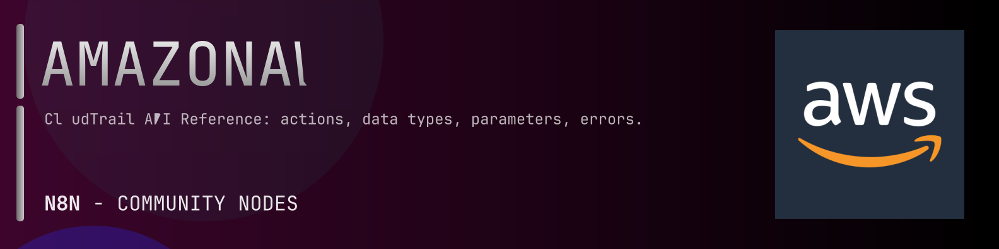

# @n8n-dev/n8n-nodes-amazonaws-cloudtrail



[](https://www.npmjs.com/package/@n8n-dev/n8n-nodes-amazonaws-cloudtrail)
[](https://opensource.org/licenses/MIT)

---

**Stop writing amazonaws-cloudtrail API integrations by hand.**

Every time you connect n8n to amazonaws-cloudtrail, you waste hours mapping endpoints, defining parameters, and debugging schemas. You copy-paste from docs, fix edge cases, and pray nothing breaks.

**What if connecting n8n to amazonaws-cloudtrail took 5 minutes, not half a day?**

This node gives you **1+ resources** out of the box: **Default**: with full CRUD operations, typed parameters, and zero manual configuration.

---

## What You Get

- **Zero boilerplate**: Resources, operations, and fields are pre-configured and ready to use
- **Full CRUD**: Create, read, update, and delete support where the API allows it
- **Typed parameters**: No more guessing field types
- **Built-in auth**: API key authentication, ready to go
- **Declarative**: Native n8n performance, no custom execute() overhead

---

## Install

```bash
npm install @n8n-dev/n8n-nodes-amazonaws-cloudtrail
```

**Or in n8n:**
1. **Settings → Community Nodes → Install**
2. Search: `@n8n-dev/n8n-nodes-amazonaws-cloudtrail`
3. Click **Install**

---

## Quick Start

1. Install the node (above)
2. Add credentials: **amazonaws-cloudtrail API** → paste your API key
3. Drag the **amazonaws-cloudtrail** node into your workflow
4. Pick a resource → pick an operation → done.

That's it. No configuration files. No code. It just works.

---

## Resources

| Resource | Operations |
|----------|------------|
| Default | Post add tags, Post cancel query, Post create channel, Post create event data store, Post create trail, Post delete channel, Post delete event data store, Post delete resource policy, Post delete trail, Post deregister organization delegated admin, Post describe query, Post describe trails, Post get channel, Post get event data store, Post get event selectors, Post get import, Post get insight selectors, Post get query results, Post get resource policy, Post get trail, Post get trail status, Post list channels, Post list event data stores, Post list import failures, Post list imports, Post list public keys, Post list queries, Post list tags, Post list trails, Post lookup events, Post put event selectors, Post put insight selectors, Post put resource policy, Post register organization delegated admin, Post remove tags, Post restore event data store, Post start import, Post start logging, Post start query, Post stop import, Post stop logging, Post update channel, Post update event data store, Post update trail |

---

## Why This Node?

**Without this node:**
- Hours of manual API integration
- Copy-pasting from amazonaws-cloudtrail docs
- Debugging auth, pagination, error handling
- Maintaining your own client code

**With this node:**
- Install → configure → use. 5 minutes.
- Auto-generated from the official amazonaws-cloudtrail OpenAPI spec
- Always up to date when the API changes
- Native n8n performance

---

## Auto-Generated
This node was auto-generated from the official **amazonaws-cloudtrail** OpenAPI specification using
[@n8n-dev/n8n-openapi-node-ultimate](https://github.com/kelvinzer0/n8n-openapi-node-ultimate),
then validated against the live API so you get accurate types and real parameters, not guesswork.

When the amazonaws-cloudtrail API updates, this node updates too.

---

## Support This Project

If this node saved you hours of work, consider supporting continued development, new APIs, better error handling, and faster updates.

[](https://n8n-code.github.io/membership/#/eyJ0aXRsZSI6IktlZXAgSXQgTW92aW5nIiwiZGVzYyI6Ik9uZSBkZXZlbG9wZXIgYnVpbHQgYSB0b29sIHRoYXQgYXV0by1nZW5lcmF0ZXNcbm44biBub2RlcyBmcm9tIGFueSBPcGVuQVBJIHNwZWMuXG5cbllvdXIgZG9uYXRpb24gZnVuZHMgbmV3IGZlYXR1cmVzLCBtb3JlIEFQSSBzdXBwb3J0LFxuYW5kIGJldHRlciB0b29saW5nIGZvciBldmVyeSBkZXZlbG9wZXIgYWZ0ZXIgeW91LiIsInRhcmdldCI6NTAwMCwiYWRkcmVzc2VzIjp7ImV0aGVyZXVtIjoiMHhmMDU1NWQ0MGRiRkI0ZTNCZjA3MDQ0MjgyQjc4RjJmRTFmNTFFZjcyIiwic29sYW5hIjoiNlpEVk5BYmpZZExEcXo4cGt3VUNHYllaNVV3QlFranB0QzU1Wk5vTFcybVUifSwiZGlzY29yZCI6Imh0dHBzOi8vZGlzY29yZC5nZy9wdERaOGU0aDkzIn0)

---

## License

MIT © [kelvinzer0](https://github.com/n8n-code)
